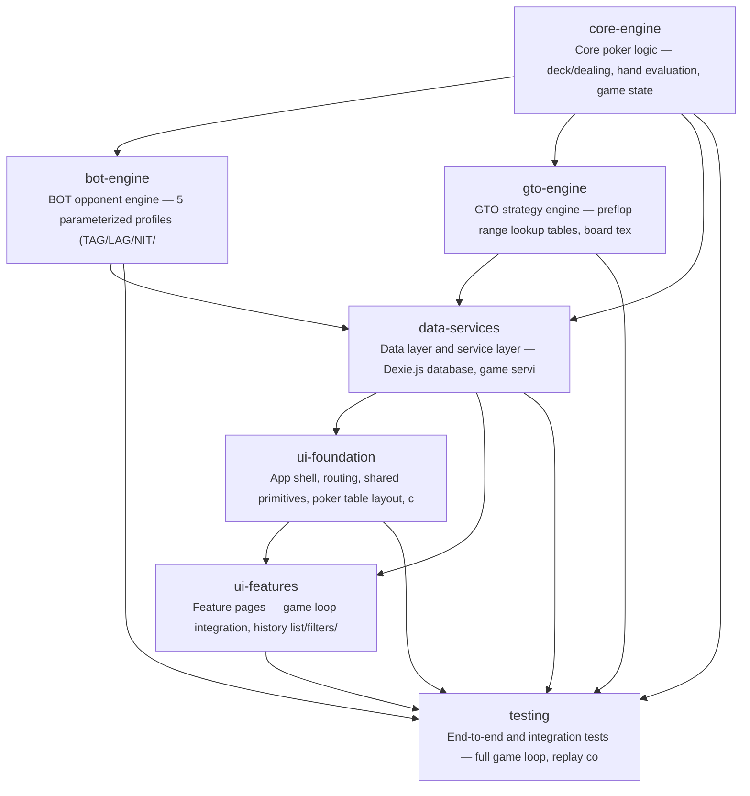

# gto-idiot

德州扑克玩家缺乏便捷的 GTO 策略练习工具，无法在实战对抗中学习并对比自己的决策与 GTO 最优策略之间的差距。GTO Idiot 提供六人桌 BOT 对战 + 赛后逐手复盘的一站式练习体验。

**Target Users:** 想要提升 GTO 策略水平的德州扑克玩家，从初学者到中级玩家，希望通过实战练习和复盘分析来改善决策质量

**Core Scenarios:**
- 开始一局六人桌 NL Hold'em 现金桌对战：用户选择座位，与 5 个不同风格的 BOT（紧凶/松凶/鱼等）进行完整牌局（Preflop → Flop → Turn → River）
- 牌局中实时操作：用户在每个决策点进行 Fold/Call/Raise 操作，BOT 根据各自风格自动行动，完整模拟真实牌桌体验
- 赛后逐手复盘：牌局结束后进入复盘模式，逐手回放每个决策点，标注 GTO 最优动作 vs 用户实际选择，显示 EV 对比
- 对战历史记录：浏览历史牌局列表，查看胜率趋势、关键统计数据，点击任意历史牌局进入复盘
- GTO 策略学习反馈：复盘中高亮用户偏离 GTO 最大的决策点，帮助用户识别自己的 leak

## Features

- **F-001**: game-engine
- **F-002**: player-actions
- **F-003**: bot-opponents
- **F-004**: table-ui
- **F-005**: gto-preflop
- **F-006**: gto-postflop
- **F-007**: hand-recorder
- **F-008**: session-history
- **F-009**: hand-replayer
- **F-010**: gto-comparison
- **F-011**: leak-finder
- **F-012**: local-storage

## Tech Stack

| Layer | Technology |
|---|---|
| Language | TypeScript (strict) |
| Framework | React 18 + Vite |
| Build Tool | npm |

## Quick Start

```bash
npm install
npm run build
```

## Architecture



## Modules

| Module | Description | Files | Features |
|---|---|---|---|
| scaffold | Project setup — Vite + React + TS + Tailwind + Dexie + Router config, shared types, folder structure | 19 | F-001, F-002, F-004, F-012 |
| core-engine | Core poker logic — deck/dealing, hand evaluation, game state machine, action validation. Pure functions with no UI dependency. | 6 | F-001, F-002 |
| bot-engine | BOT opponent engine — 5 parameterized profiles (TAG/LAG/NIT/Fish/Maniac), preflop range tables, postflop heuristic decision trees, randomization layer. | 5 | F-003 |
| gto-engine | GTO strategy engine — preflop range lookup tables, board texture classifier, Monte Carlo equity calculator (Web Worker), postflop heuristic recommendation engine. | 7 | F-005, F-006, F-010 |
| data-services | Data layer and service layer — Dexie.js database, game service orchestration, hand recording, history/stats/replay/analysis services. | 7 | F-001, F-002, F-003, F-007, F-008, F-009, F-010, F-011, F-012 |
| ui-foundation | App shell, routing, shared primitives, poker table layout, card/chip components, action panel, and seat selector. | 21 | F-002, F-004 |
| ui-features | Feature pages — game loop integration, history list/filters/stats/profit chart, hand replayer with timeline, GTO analysis panels, settings/storage management. | 24 | F-001, F-002, F-003, F-004, F-008, F-009, F-010, F-011, F-012 |
| testing | End-to-end and integration tests — full game loop, replay correctness, GTO analysis accuracy, service layer tests. | 8 | F-001, F-002, F-003, F-004, F-005, F-006, F-007, F-008, F-009, F-010, F-011, F-012 |

## Project Structure

```
code/
├── src/
│   ├── __tests__/
│   │   ├── e2e/
│   │   ├── engine/
│   │   └── services/
│   ├── components/
│   │   ├── action/
│   │   ├── history/
│   │   ├── shared/
│   │   ├── shell/
│   │   └── table/
│   ├── contexts/
│   │   ├── GameContext.tsx
│   │   └── ReplayContext.tsx
│   ├── engine/
│   │   ├── bot/
│   │   ├── gto/
│   │   ├── action-validator.ts
│   │   ├── deck.ts
│   │   ├── game-state.ts
│   │   ├── hand-evaluator.ts
│   │   ├── pot-calculator.ts
│   │   └── utils.ts
│   ├── hooks/
│   │   ├── useActionPanel.ts
│   │   ├── useCardDeal.ts
│   │   ├── useChipMove.ts
│   │   └── useReplayNavigation.ts
│   ├── pages/
│   │   └── PlayPage.tsx
│   ├── services/
│   │   ├── analysis-service.ts
│   │   ├── db.ts
│   │   ├── game-service.ts
│   │   ├── hand-recorder.ts
│   │   ├── history-service.ts
│   │   ├── replay-service.ts
│   │   └── storage-service.ts
│   ├── types/
│   │   ├── analysis.ts
│   │   ├── bot.ts
│   │   ├── card.ts
│   │   ├── game.ts
│   │   └── gto.ts
│   ├── App.tsx
│   ├── index.css
│   ├── main.tsx
│   └── vite-env.d.ts
├── index.html
├── package-lock.json
├── package.json
├── postcss.config.js
├── tailwind.config.d.ts
├── tailwind.config.ts
├── tsconfig.json
├── tsconfig.node.json
├── tsconfig.node.tsbuildinfo
├── tsconfig.tsbuildinfo
├── vite.config.d.ts
├── vite.config.ts
└── vitest.config.ts
```

---

_Generated by [Mosaicat](https://github.com/ZB-ur/mosaicat) pipeline_