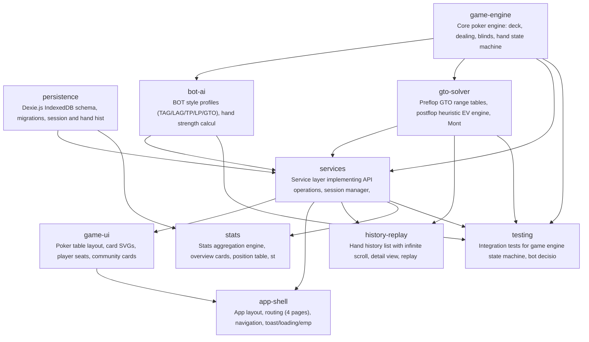

# gto-idiot

德州扑克玩家缺乏便捷的 GTO 策略练习工具，无法在实战模拟中学习最优决策并量化自己与 GTO 策略的差距。GTO Idiot 通过 6 人桌 BOT 对战 + 赛后 EV 复盘，让玩家在实践中掌握 GTO 策略。

**Target Users:** 希望提升 GTO 策略水平的德州扑克玩家，从入门到中级水平，能理解基本术语（EV、SPR、位置等）

**Core Scenarios:**
- 开始新牌局：用户选择座位，与 5 个不同风格的 BOT（TAG/LAG/TP/LP/GTO）进行完整 6 人桌现金局对战（100BB 深筹码，固定盲注）
- 完整牌局流程：Preflop → Flop → Turn → River，每个决策点用户选择 Fold/Check/Call/Raise/All-in，BOT 根据各自风格和简化 GTO solver 做出决策
- 实时对战界面：展示公共牌、底池、各玩家筹码、位置信息、当前行动提示
- 赛后复盘：牌局结束后查看手牌历史回放，每个决策点标注 GTO 推荐动作及用户实际动作的 EV 差值
- 对战记录：浏览历史牌局列表，查看胜率统计、累计 EV 损失等关键指标
- GTO 策略对比：在复盘中对比用户决策 vs GTO 最优策略，可视化展示偏差

## Features

- **F-001**: game-engine
- **F-002**: bot-ai
- **F-003**: gto-solver
- **F-004**: game-ui
- **F-005**: hand-history
- **F-006**: hand-replay
- **F-007**: stats-dashboard
- **F-008**: session-management

## Tech Stack

| Layer | Technology |
|---|---|
| Language | TypeScript |
| Framework | React 18 + Vite |
| Build Tool | npm |

## Quick Start

```bash
npm install
npm run build
```

## Architecture



## Modules

| Module | Description | Files | Features |
|---|---|---|---|
| scaffold | Vite + React + TS + Tailwind project setup, shared types, ESLint config, folder structure | 15 | F-004 |
| persistence | Dexie.js IndexedDB schema, migrations, session and hand history repositories | 4 | F-005 |
| game-engine | Core poker engine: deck, dealing, blinds, hand state machine, betting rounds, pot manager, hand evaluator, settlement | 8 | F-001 |
| bot-ai | BOT style profiles (TAG/LAG/TP/LP/GTO), hand strength calculator, position-aware decision engine | 4 | F-002 |
| gto-solver | Preflop GTO range tables, postflop heuristic EV engine, Monte Carlo simulation, Web Worker with timeout/fallback | 8 | F-003 |
| services | Service layer implementing API operations, session manager, seat assignment, Zustand stores (game/session/ui) | 13 | F-001, F-005, F-008 |
| game-ui | Poker table layout, card SVGs, player seats, community cards, pot display, action panel, raise slider, animations, game loop integration | 11 | F-001, F-002, F-004 |
| app-shell | App layout, routing (4 pages), navigation, toast/loading/empty states, error handling, lazy loading for replay/stats | 10 | F-004, F-008 |
| history-replay | Hand history list with infinite scroll, detail view, replay engine with timeline/step navigation, GTO decision analysis panel | 10 | F-005, F-006 |
| stats | Stats aggregation engine, overview cards, position table, street EV chart, profit trend chart (Recharts) | 7 | F-007 |
| testing | Integration tests for game engine state machine, bot decisions, GTO evaluation, service layer; E2E smoke tests | 8 | F-001, F-002, F-003, F-004, F-005, F-006, F-007, F-008 |

## Project Structure

```
code/
├── src/
│   ├── bot/
│   │   ├── bot-profiles.ts
│   │   ├── decision-engine.ts
│   │   └── hand-strength.ts
│   ├── components/
│   │   ├── common/
│   │   ├── game/
│   │   ├── layout/
│   │   ├── session/
│   │   └── stats/
│   ├── engine/
│   │   ├── betting-round.ts
│   │   ├── deck-manager.ts
│   │   ├── hand-evaluator.ts
│   │   └── pot-manager.ts
│   ├── gto/
│   │   └── preflop-range-data.ts
│   ├── pages/
│   │   ├── DashboardPage.tsx
│   │   ├── GamePage.tsx
│   │   ├── HistoryPage.tsx
│   │   └── StatsPage.tsx
│   ├── persistence/
│   │   ├── database.ts
│   │   ├── hand-history-repository.ts
│   │   ├── index.ts
│   │   └── session-repository.ts
│   ├── replay/
│   │   ├── replay-engine.ts
│   │   └── timeline.ts
│   ├── stats/
│   │   └── stats-aggregator.ts
│   ├── types/
│   │   ├── cards.ts
│   │   ├── game.ts
│   │   ├── gto.ts
│   │   ├── index.ts
│   │   ├── session.ts
│   │   └── stats.ts
│   ├── App.tsx
│   ├── index.css
│   ├── main.tsx
│   └── routes.tsx
├── index.html
├── package-lock.json
├── package.json
├── postcss.config.js
├── tailwind.config.js
├── tsconfig.json
├── tsconfig.node.json
└── vite.config.ts
```

---

_Generated by [Mosaicat](https://github.com/ZB-ur/mosaicat) pipeline_