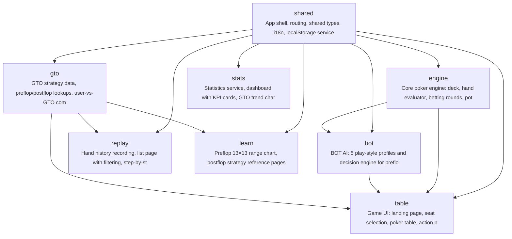

# gto-idiot

德州扑克初学者缺乏安全、低压力的环境来练习和理解GTO策略，无法直观对比自己的决策与最优策略的差距。GTO Idiot 提供一个六人桌BOT对战练习器，帮助初学者通过实战+复盘快速掌握GTO基础。

**Target Users:** 德州扑克初学者，刚接触GTO概念，需要大量引导和解释，希望通过对战练习理解正确的策略思路

**Core Scenarios:**
- 开始一局六人桌现金桌对战：用户选择座位、买入筹码，与5个不同风格的BOT（紧凶、松凶、鱼等）进行固定盲注的现金桌对战
- 牌局中做出决策：在每个行动点（preflop/flop/turn/river）选择fold/call/raise，观察BOT的行动过程（带短暂停顿的观察模式）
- 赛后逐手复盘：牌局结束后回放每一手牌，在每个决策点对比用户的实际选择与GTO最优选择，标注偏差
- 查看统计数据：查看整体胜率、GTO吻合度（用户决策与GTO一致的比例）、常见错误类型分类
- 学习GTO基础：通过内置的preflop range chart和简化postflop策略表，理解不同位置和场景的最优行动

## Features

- **F-001**: game-table-setup
- **F-002**: poker-engine
- **F-003**: player-actions
- **F-004**: bot-ai
- **F-005**: observation-mode
- **F-006**: hand-history-recording
- **F-007**: hand-replay
- **F-008**: gto-comparison
- **F-009**: statistics-dashboard
- **F-010**: preflop-range-chart
- **F-011**: poker-table-ui
- **F-012**: i18n-bilingual
- **F-013**: data-persistence
- **F-014**: speed-settings
- **F-015**: landing-page
- **F-016**: postflop-strategy-reference
- **F-017**: error-type-learning

## Tech Stack

| Layer | Technology |
|---|---|
| Language | TypeScript |
| Framework | React 18 + Vite 5 |
| Build Tool | npm |

## Quick Start

```bash
npm install
npm run build
```

## Architecture



## Modules

| Module | Description | Files | Features |
|---|---|---|---|
| scaffold | Project config: package.json, tsconfig, vite config, tailwind, index.html, env types | 9 | — |
| shared | App shell, routing, shared types, i18n, localStorage service, settings, layout components, empty states | 20 | F-011, F-012, F-013, F-014, F-015 |
| engine | Core poker engine: deck, hand evaluator, betting rounds, pot calculator, engine facade | 6 | F-002 |
| bot | BOT AI: 5 play-style profiles and decision engine for preflop/postflop | 3 | F-004, F-005 |
| gto | GTO strategy data, preflop/postflop lookups, user-vs-GTO comparison service | 5 | F-008, F-016 |
| table | Game UI: landing page, seat selection, poker table, action panel, game loop, session store, animations | 19 | F-001, F-003, F-005, F-011, F-015 |
| replay | Hand history recording, list page with filtering, step-by-step replay viewer with GTO annotations | 9 | F-006, F-007 |
| stats | Statistics service, dashboard with KPI cards, GTO trend chart, error category list with tips | 8 | F-009, F-017 |
| learn | Preflop 13×13 range chart, postflop strategy reference pages, in-game range overlay | 11 | F-010, F-016 |

## Project Structure

```
code/
├── src/
│   ├── components/
│   │   ├── actions/
│   │   ├── layout/
│   │   ├── learn/
│   │   ├── replay/
│   │   ├── settings/
│   │   ├── stats/
│   │   ├── table/
│   │   └── ui/
│   ├── data/
│   │   ├── botProfiles.ts
│   │   ├── errorDefinitions.ts
│   │   ├── postflopStrategies.ts
│   │   └── preflopRanges.ts
│   ├── hooks/
│   ├── i18n/
│   │   ├── en.json
│   │   ├── index.ts
│   │   └── zh.json
│   ├── pages/
│   ├── services/
│   │   ├── bettingRound.ts
│   │   ├── botEngine.ts
│   │   ├── deck.ts
│   │   ├── gtoComparison.ts
│   │   ├── gtoService.ts
│   │   ├── handEvaluator.ts
│   │   ├── handRecorder.ts
│   │   ├── pokerEngine.ts
│   │   ├── potCalculator.ts
│   │   ├── replayEngine.ts
│   │   ├── settingsService.ts
│   │   ├── statisticsService.ts
│   │   └── storageService.ts
│   ├── stores/
│   ├── styles/
│   │   └── animations.css
│   ├── types/
│   │   ├── bot.ts
│   │   ├── card.ts
│   │   ├── engine.ts
│   │   ├── game.ts
│   │   ├── gto.ts
│   │   ├── gtoData.ts
│   │   └── index.ts
│   ├── App.css
│   ├── App.tsx
│   ├── index.css
│   ├── main.tsx
│   └── vite-env.d.ts
├── index.html
├── package-lock.json
├── package.json
├── postcss.config.js
├── tailwind.config.js
├── tsconfig.app.json
├── tsconfig.app.tsbuildinfo
├── tsconfig.json
├── tsconfig.node.json
├── tsconfig.node.tsbuildinfo
└── vite.config.ts
```

---

_Generated by [Mosaicat](https://github.com/ZB-ur/mosaicat) pipeline_