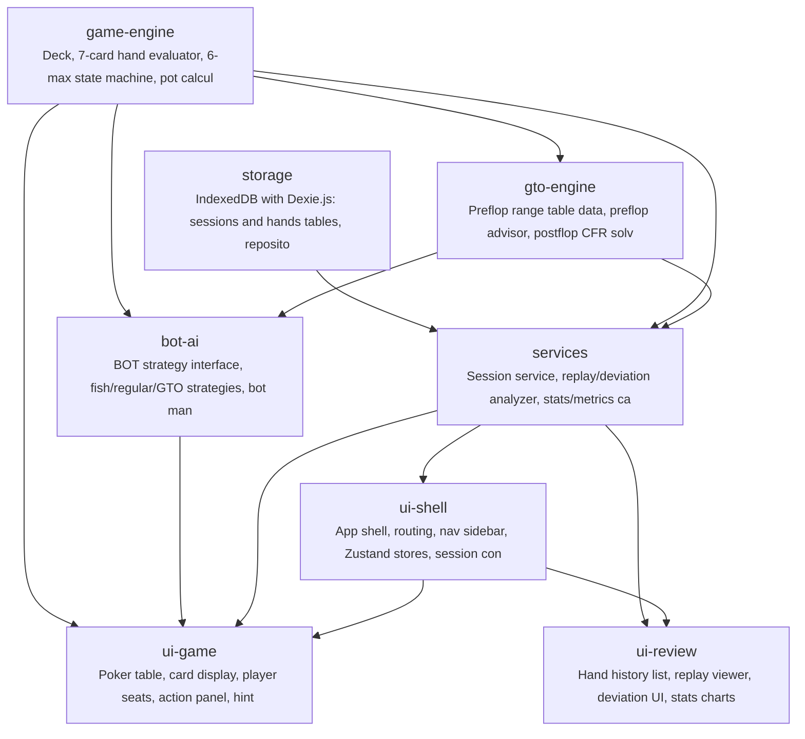

# gto-idiot

中级德州扑克玩家缺乏便捷的GTO策略练习工具，无法在实战模拟中对比自己的决策与标准GTO策略的偏差，难以系统性地提升GTO执行力。

**Target Users:** 中级德州扑克玩家 — 已了解基本策略（位置、起手牌范围、底池赔率等），希望通过反复练习和复盘来提升GTO执行准确度的玩家。

**Core Scenarios:**
- 开始牌局：用户选择BOT数量（1-5个对手）和难度级别（鱼/常规/GTO），在6-max现金桌中进行牌局对战
- 实时对战：用户在每个决策点（翻前/翻后/转牌/河牌）做出行动（弃牌/跟注/加注），BOT基于其难度配置做出响应，牌局流畅进行
- GTO提示（可选）：用户可在决策时请求查看当前局面的GTO建议动作和频率分布，作为学习辅助
- 对战记录：每手牌自动记录完整牌局历史（行动序列、底池变化、最终结果），存储在浏览器本地
- 赛后复盘：用户浏览历史牌局，逐步回放每手牌，系统标记用户决策与GTO策略的偏差（如GTO建议加注但用户跟注），显示偏差程度
- 统计总览：查看整体对战数据（胜率、盈亏曲线、最常见的GTO偏差类型）帮助用户识别系统性弱点

## Features

- **F-001**: game-engine
- **F-002**: bot-ai
- **F-003**: preflop-gto
- **F-004**: postflop-gto
- **F-005**: gto-hint
- **F-006**: hand-history
- **F-007**: hand-replay
- **F-008**: deviation-analysis
- **F-009**: stats-dashboard
- **F-010**: session-management
- **F-011**: poker-table-ui

## Tech Stack

| Layer | Technology |
|---|---|
| Language | TypeScript |
| Framework | React 18 + Vite |
| Build Tool | npm |

## Quick Start

```bash
npm install
npm run build
```

## Architecture



## Modules

| Module | Description | Files | Features |
|---|---|---|---|
| scaffold | Vite + React + TypeScript + Tailwind project setup, entry point, global types | 11 | F-011 |
| storage | IndexedDB with Dexie.js: sessions and hands tables, repositories, storage management | 3 | F-006, F-010 |
| game-engine | Deck, 7-card hand evaluator, 6-max state machine, pot calculator | 5 | F-001 |
| gto-engine | Preflop range table data, preflop advisor, postflop CFR solver, Web Worker | 5 | F-003, F-004, F-005 |
| bot-ai | BOT strategy interface, fish/regular/GTO strategies, bot manager | 4 | F-002 |
| services | Session service, replay/deviation analyzer, stats/metrics calculator, GTO hint integration | 6 | F-005, F-007, F-008, F-009, F-010 |
| ui-shell | App shell, routing, nav sidebar, Zustand stores, session config/controls, home page | 12 | F-009, F-010, F-011 |
| ui-game | Poker table, card display, player seats, action panel, hint popover, game loop integration | 7 | F-001, F-002, F-005, F-011 |
| ui-review | Hand history list, replay viewer, deviation UI, stats charts, error boundaries, performance tuning | 8 | F-004, F-006, F-007, F-008, F-009 |

## Project Structure

```
code/
├── src/
│   ├── bot/
│   │   ├── strategies/
│   │   └── bot-manager.ts
│   ├── components/
│   │   ├── common/
│   │   ├── game/
│   │   ├── history/
│   │   ├── replay/
│   │   ├── session/
│   │   ├── shell/
│   │   └── stats/
│   ├── engine/
│   │   ├── action-validator.ts
│   │   ├── deck.ts
│   │   ├── game-engine.ts
│   │   ├── hand-evaluator.ts
│   │   └── pot-calculator.ts
│   ├── gto/
│   │   ├── cfr-worker.ts
│   │   ├── game-tree.ts
│   │   ├── postflop-solver.ts
│   │   ├── preflop-advisor.ts
│   │   └── preflop-ranges.ts
│   ├── services/
│   │   ├── deviation-analyzer.ts
│   │   ├── gto-hint-service.ts
│   │   ├── metrics-calculator.ts
│   │   ├── replay-service.ts
│   │   ├── session-service.ts
│   │   └── stats-service.ts
│   ├── storage/
│   │   ├── database.ts
│   │   ├── hand-repository.ts
│   │   └── session-repository.ts
│   ├── stores/
│   │   ├── game-store.ts
│   │   ├── session-store.ts
│   │   └── ui-store.ts
│   ├── types/
│   │   └── index.ts
│   ├── App.tsx
│   ├── index.css
│   └── main.tsx
├── tests/
│   ├── bot/
│   │   ├── bot-manager.test.ts
│   │   ├── fish-strategy.test.ts
│   │   ├── gto-bot-strategy.test.ts
│   │   └── regular-strategy.test.ts
│   ├── components/
│   │   ├── common/
│   │   ├── game/
│   │   ├── history/
│   │   ├── replay/
│   │   ├── session/
│   │   ├── shell/
│   │   └── stats/
│   ├── engine/
│   │   ├── action-validator.test.ts
│   │   ├── deck.test.ts
│   │   ├── game-engine.test.ts
│   │   ├── hand-evaluator.test.ts
│   │   └── pot-calculator.test.ts
│   ├── gto/
│   │   ├── cfr-worker.test.ts
│   │   ├── game-tree.test.ts
│   │   ├── postflop-solver.test.ts
│   │   ├── preflop-advisor.test.ts
│   │   └── preflop-ranges.test.ts
│   ├── integration/
│   │   └── game-loop.test.ts
│   ├── services/
│   │   ├── deviation-analyzer.test.ts
│   │   ├── metrics-calculator.test.ts
│   │   └── replay-service.test.ts
│   ├── storage/
│   ├── stores/
│   ├── types/
│   │   └── index.test.ts
│   └── setup.ts
├── index.html
├── package-lock.json
├── package.json
├── postcss.config.js
├── README.md
├── tailwind.config.ts
├── tsconfig.json
├── tsconfig.node.json
└── vite.config.ts
```

---

_Generated by [Mosaicat](https://github.com/ZB-ur/mosaicat) pipeline_