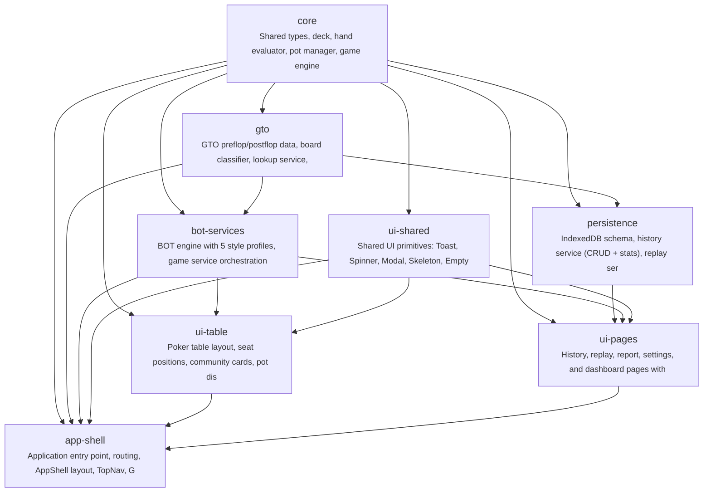

# gto-idiot

中级德州扑克玩家缺乏实战化的GTO策略练习工具，无法在模拟对战中发现自己的策略偏离并针对性改进。GTO Idiot 提供六人桌BOT对战 + 赛后GTO对比复盘，帮助玩家在实战中内化GTO思维。

**Target Users:** 中级德州扑克玩家 — 已了解基本GTO概念（开局范围、位置意识、底池赔率），希望通过反复实战练习将理论转化为直觉

**Core Scenarios:**
- 开始一局六人桌Cash Game：玩家选择盲注级别，系统分配5个不同风格的BOT对手（紧凶/松凶/鱼等），进行标准无限德州扑克牌局
- 牌局中做决策：每个决策点（Preflop/Flop/Turn/River）玩家选择 Fold/Check/Call/Raise，BOT根据各自风格和内置策略表做出回应
- 查看对战记录：浏览历史牌局列表，查看每局的盈亏、关键手牌统计
- 赛后复盘单手牌：逐街回放牌局过程，每个决策点展示玩家实际操作 vs GTO最优操作，用颜色标记偏离点（绿色=符合GTO，黄色=轻微偏离，红色=严重偏离）
- 查看整体GTO符合度报告：汇总多手牌的GTO偏离统计，识别玩家最薄弱的决策场景（如：3-bet pot OOP过度check等）

## Features

- **F-001**: game-table
- **F-002**: player-actions
- **F-003**: bot-engine
- **F-004**: gto-data
- **F-005**: hand-evaluator
- **F-006**: hand-history
- **F-007**: hand-replay
- **F-008**: gto-report
- **F-009**: settings
- **F-010**: card-ui

## Tech Stack

| Layer | Technology |
|---|---|
| Language | TypeScript |
| Framework | React 18 + Vite |
| Build Tool | npm |

## Quick Start

```bash
npm install
npm run build
```

## Architecture



## Modules

| Module | Description | Files | Features |
|---|---|---|---|
| scaffold | Project config: Vite, TypeScript, Tailwind, ESLint, folder structure | 8 | — |
| core | Shared types, deck, hand evaluator, pot manager, game engine state machine | 7 | F-001, F-002, F-005 |
| gto | GTO preflop/postflop data, board classifier, lookup service, static JSON assets | 6 | F-004 |
| bot-services | BOT engine with 5 style profiles, game service orchestration, settings service, Zustand game store | 6 | F-001, F-002, F-003, F-009 |
| persistence | IndexedDB schema, history service (CRUD + stats), replay service (GTO analysis), report service (compliance aggregation) | 5 | F-006, F-007, F-008 |
| ui-shared | Shared UI primitives: Toast, Spinner, Modal, Skeleton, EmptyState, Tooltip, LoadingScreen, PlayingCard | 8 | F-010 |
| ui-table | Poker table layout, seat positions, community cards, pot display, action panel, raise slider, game page, animations | 8 | F-001, F-002, F-010 |
| ui-pages | History, replay, report, settings, and dashboard pages with feature-specific sub-components | 8 | F-006, F-007, F-008, F-009, F-010 |
| app-shell | Application entry point, routing, AppShell layout, TopNav, GTO data init, error handling, sound effects, code splitting | 6 | F-001, F-004, F-006, F-009, F-010 |

## Project Structure

```
code/
├── public/
│   └── data/
│       └── gto/
├── src/
│   ├── bot/
│   │   ├── bot-engine.ts
│   │   ├── index.ts
│   │   └── style-profiles.ts
│   ├── db/
│   │   ├── index.ts
│   │   └── schema.ts
│   ├── engine/
│   │   ├── deck.ts
│   │   ├── game-engine.ts
│   │   ├── hand-evaluator.ts
│   │   ├── index.ts
│   │   └── pot-manager.ts
│   ├── gto/
│   │   ├── board-classifier.ts
│   │   ├── gto-service.ts
│   │   ├── index.ts
│   │   ├── postflop-loader.ts
│   │   └── preflop-data.ts
│   ├── pages/
│   │   ├── DashboardPage.tsx
│   │   ├── GamePage.tsx
│   │   ├── HistoryPage.tsx
│   │   ├── ReplayPage.tsx
│   │   ├── ReportPage.tsx
│   │   └── SettingsPage.tsx
│   ├── services/
│   │   ├── game-service.ts
│   │   ├── history-service.ts
│   │   ├── replay-service.ts
│   │   ├── report-service.ts
│   │   └── settings-service.ts
│   ├── store/
│   │   └── game-store.ts
│   ├── ui/
│   │   ├── actions/
│   │   ├── components/
│   │   ├── history/
│   │   ├── replay/
│   │   ├── report/
│   │   ├── shared/
│   │   └── table/
│   ├── App.css
│   ├── App.tsx
│   ├── index.css
│   ├── main.tsx
│   ├── types.ts
│   └── vite-env.d.ts
├── tests/
│   ├── app/
│   │   ├── app-shell.test.tsx
│   │   └── error-handling.test.ts
│   ├── bot/
│   │   └── bot-engine.test.ts
│   ├── core/
│   │   ├── deck.test.ts
│   │   ├── game-engine.test.ts
│   │   ├── hand-evaluator.test.ts
│   │   ├── pot-manager.test.ts
│   │   └── types.test.ts
│   ├── e2e/
│   │   └── full-game-flow.test.tsx
│   ├── gto/
│   │   ├── board-classifier.test.ts
│   │   ├── gto-service.test.ts
│   │   ├── postflop-loader.test.ts
│   │   └── preflop-data.test.ts
│   ├── performance/
│   │   └── performance.test.ts
│   ├── persistence/
│   │   ├── hand-saving.test.ts
│   │   ├── history-service.test.ts
│   │   └── schema.test.ts
│   ├── services/
│   │   ├── game-service.test.ts
│   │   ├── replay-service.test.ts
│   │   ├── report-service.test.ts
│   │   └── settings-service.test.ts
│   ├── store/
│   │   └── game-store.test.ts
│   ├── ui/
│   │   ├── action-panel.test.tsx
│   │   ├── animations.test.tsx
│   │   ├── history-page.test.tsx
│   │   ├── playing-card.test.tsx
│   │   ├── poker-table.test.tsx
│   │   ├── replay-page.test.tsx
│   │   ├── report-page.test.tsx
│   │   ├── settings-page.test.tsx
│   │   ├── shared.test.tsx
│   │   └── sound-effects.test.ts
│   └── setup.ts
├── index.html
├── package-lock.json
├── package.json
├── postcss.config.js
├── README.md
├── tailwind.config.js
├── tsconfig.app.json
├── tsconfig.json
├── tsconfig.node.json
└── vite.config.ts
```

---

_Generated by [Mosaicat](https://github.com/ZB-ur/mosaicat) pipeline_