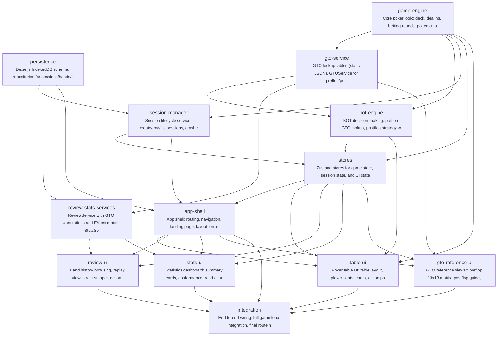

# gto-idiot

德州扑克玩家缺乏便捷的 GTO 策略练习工具，无法在实战环境中对比自己的决策与 GTO 最优解，难以系统性地发现和纠正策略偏差。

**Target Users:** 想要提升 GTO 策略水平的德州扑克玩家，从入门到中级水平，希望通过与 GTO BOT 对战来训练决策能力。

**Core Scenarios:**
- 用户加入一张 6 人桌（1 人类 + 5 GTO BOT），进行完整的德州扑克牌局（Preflop → Flop → Turn → River），固定盲注 100BB 起始筹码
- 牌局中用户做出 fold/call/raise 决策，5 个 BOT 对手全部按 GTO 策略行动，提供纯 GTO 练习环境
- 牌局结束后查看对战结果记录，包括每手牌的胜负、筹码变化、关键决策点
- 赛后复盘：逐手回放，展示用户每个决策点的实际操作 vs GTO 最优决策，标注偏差程度（如：你 fold 了但 GTO 建议 raise 到 2.5BB）
- 查看历史对战统计，追踪自己的 GTO 符合度变化趋势

## Features

- **F-001**: game-engine
- **F-002**: gto-lookup-table
- **F-003**: bot-decision-engine
- **F-004**: table-ui
- **F-005**: hand-history-record
- **F-006**: session-management
- **F-007**: post-game-review
- **F-008**: history-stats

## Tech Stack

| Layer | Technology |
|---|---|
| Language | TypeScript |
| Framework | React 18 + Vite + Tailwind CSS |
| Build Tool | npm |

## Quick Start

```bash
npm install
npm run build
```

## Architecture



## Modules

| Module | Description | Files | Features |
|---|---|---|---|
| scaffold | Project setup: Vite + React + TS + Tailwind, shared types, entry point with placeholder App | 17 | F-001, F-004 |
| persistence | Dexie.js IndexedDB schema, repositories for sessions/hands/sessionState, CRUD operations | 5 | F-005, F-006 |
| game-engine | Core poker logic: deck, dealing, betting rounds, pot calculation, hand evaluation, game orchestrator | 6 | F-001 |
| gto-service | GTO lookup tables (static JSON), GTOService for preflop/postflop queries, GTO comparison logic | 9 | F-002, F-007 |
| bot-engine | BOT decision-making: preflop GTO lookup, postflop strategy with randomization | 2 | F-003 |
| session-manager | Session lifecycle service: create/end/list sessions, crash recovery, player initialization | 2 | F-006 |
| review-stats-services | ReviewService with GTO annotations and EV estimator, StatsService for aggregated analytics | 3 | F-007, F-008 |
| stores | Zustand stores for game state, session state, and UI state | 4 | F-001, F-004 |
| app-shell | App shell: routing, navigation, landing page, layout, error boundaries, loading states, responsive layout | 9 | F-004, F-006 |
| table-ui | Poker table UI: table layout, player seats, cards, action panel, raise slider, pot display, animations, session controls | 10 | F-001, F-003, F-004, F-006 |
| review-ui | Hand history browsing, replay view, street stepper, action timeline with GTO badges, mini table | 9 | F-005, F-007 |
| stats-ui | Statistics dashboard: summary cards, conformance trend chart, position/street breakdowns, deviation ranking | 7 | F-008 |
| gto-reference-ui | GTO reference viewer: preflop 13x13 matrix, postflop guide, position/scenario selectors, disclaimer | 8 | F-002 |
| integration | End-to-end wiring: full game loop integration, final route hookup, deployment config | 3 | F-001, F-003, F-004, F-005, F-006, F-007, F-008 |

## Project Structure

```
code/
├── public/
│   └── data/
│       ├── postflop-guides.json
│       └── preflop-charts.json
├── src/
│   ├── {types}/
│   ├── bot/
│   │   └── bot-engine.ts
│   ├── components/
│   │   ├── common/
│   │   ├── gto/
│   │   ├── review/
│   │   ├── shell/
│   │   ├── stats/
│   │   └── table/
│   ├── engine/
│   │   ├── betting-round.ts
│   │   ├── deck.ts
│   │   ├── game-engine.ts
│   │   ├── hand-evaluator.ts
│   │   ├── index.ts
│   │   └── pot-calculator.ts
│   ├── hooks/
│   │   └── useGameFlow.ts
│   ├── persistence/
│   │   ├── database.ts
│   │   ├── hand-repository.ts
│   │   ├── index.ts
│   │   ├── session-repository.ts
│   │   └── session-state-repository.ts
│   ├── services/
│   │   ├── ev-estimator.ts
│   │   ├── index.ts
│   │   └── session-service.ts
│   ├── stores/
│   │   ├── game-store.ts
│   │   ├── index.ts
│   │   ├── session-store.ts
│   │   └── ui-store.ts
│   ├── types/
│   │   ├── gto.ts
│   │   ├── index.ts
│   │   ├── poker.ts
│   │   ├── review.ts
│   │   ├── session.ts
│   │   └── stats.ts
│   ├── App.tsx
│   ├── index.css
│   ├── main.tsx
│   └── vite-env.d.ts
├── index.html
├── package-lock.json
├── package.json
├── postcss.config.js
├── tailwind.config.js
├── tsconfig.json
├── tsconfig.node.json
├── tsconfig.node.tsbuildinfo
├── tsconfig.tsbuildinfo
├── vite.config.d.ts
└── vite.config.ts
```

---

_Generated by [Mosaicat](https://github.com/ZB-ur/mosaicat) pipeline_