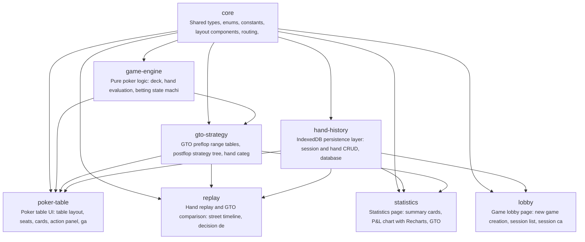

# gto-idiot

德州扑克初学者缺乏安全、低成本的GTO策略练习环境。GTO Idiot 提供一个6人桌现金桌模拟器，让用户与不同风格的BOT对战，打完后通过逐手复盘对比标准GTO策略，帮助初学者理解和内化GTO决策。

**Target Users:** 德州扑克初学者，刚接触GTO概念，需要大量引导和解释。通过浏览器访问Web应用，无需安装。

**Core Scenarios:**
- 开始牌局：用户进入6人桌现金桌（固定1/2盲注，200BB买入），与5个不同风格的BOT（紧凶、松凶、鱼等）进行对战
- 牌局对战：用户在每个决策点做出 fold/call/raise 操作，牌局中不提供GTO提示，纯对战体验
- 牌局记录：每手牌的完整 hand history 自动保存到后端，包括所有玩家动作、公共牌、底池变化
- 赛后复盘：逐手回放历史牌局，每个决策点显示用户的实际选择 vs GTO推荐动作，并展示EV差异
- 对战结果统计：查看历史对战的盈亏记录和基本统计数据

## Features

- **F-001**: poker-table-ui
- **F-002**: player-actions
- **F-003**: game-engine
- **F-004**: bot-players
- **F-005**: gto-strategy-data
- **F-006**: hand-history-storage
- **F-007**: hand-replay
- **F-008**: session-stats
- **F-009**: game-lobby
- **F-010**: gto-explanation
- **F-011**: hand-list-browser
- **F-012**: sound-effects
- **F-013**: card-deal-animation

## Tech Stack

| Layer | Technology |
|---|---|
| Language | TypeScript |
| Framework | React 18 + Vite |
| Build Tool | npm |

## Quick Start

```bash
npm install
npm run build
```

## Architecture



## Modules

| Module | Description | Files | Features |
|---|---|---|---|
| scaffold | Project config: package.json, tsconfig, Vite config, Tailwind config, index.html | 9 | -- |
| core | Shared types, enums, constants, layout components, routing, app shell, error/toast UI | 13 | F-001, F-009 |
| game-engine | Pure poker logic: deck, hand evaluation, betting state machine, pot calculator, available actions | 7 | F-002, F-003 |
| hand-history | IndexedDB persistence layer: session and hand CRUD, database schema, service abstraction | 5 | F-006, F-009 |
| gto-strategy | GTO preflop range tables, postflop strategy tree, hand categorizer, BOT decision engine, EV estimator | 8 | F-004, F-005, F-007 |
| poker-table | Poker table UI: table layout, seats, cards, action panel, game session hooks, BOT actions, animations, sounds | 19 | F-001, F-002, F-003, F-004, F-012, F-013 |
| lobby | Game lobby page: new game creation, session list, session cards, empty state | 6 | F-009 |
| replay | Hand replay and GTO comparison: street timeline, decision detail, rating badges, hand list browser, explanation text | 18 | F-007, F-010, F-011 |
| statistics | Statistics page: summary cards, P&L chart with Recharts, GTO compliance rate, average EV loss | 7 | F-008 |

## Project Structure

```
code/
├── {src/
│   ├── components}/
│   ├── engine}/
│   ├── features/
│   │   ├── lobby/
│   │   ├── replay/
│   │   ├── stats/
│   │   └── table/
│   ├── gto/
│   │   └── data}/
│   └── services}/
├── src/
│   ├── components/
│   │   ├── ConfirmDialog.tsx
│   │   ├── EmptyStateIllustration.tsx
│   │   ├── ErrorFullScreen.tsx
│   │   ├── PageContainer.tsx
│   │   ├── SkeletonLoader.tsx
│   │   ├── ToastNotification.tsx
│   │   └── TopNavBar.tsx
│   ├── engine/
│   │   ├── available-actions.ts
│   │   ├── betting-round.ts
│   │   ├── deck.ts
│   │   ├── hand-evaluator.ts
│   │   ├── index.ts
│   │   ├── pot-calculator.ts
│   │   └── types.ts
│   ├── features/
│   │   ├── lobby/
│   │   ├── replay/
│   │   ├── stats/
│   │   └── table/
│   ├── gto/
│   │   ├── data/
│   │   ├── bot-engine.ts
│   │   ├── ev-estimator.ts
│   │   ├── hand-categorizer.ts
│   │   ├── index.ts
│   │   ├── postflop-strategy.ts
│   │   ├── preflop-ranges.ts
│   │   └── types.ts
│   ├── gto-strategy/
│   │   ├── postflop-strategy.ts
│   │   └── preflop-ranges.ts
│   ├── hand-history/
│   │   └── services/
│   ├── replay/
│   │   └── services/
│   ├── services/
│   │   ├── db.ts
│   │   ├── hand-service.ts
│   │   ├── preference-service.ts
│   │   ├── session-service.ts
│   │   └── types.ts
│   ├── statistics/
│   │   └── services/
│   ├── App.css
│   ├── App.tsx
│   ├── constants.ts
│   ├── index.css
│   ├── main.tsx
│   ├── types.ts
│   └── vite-env.d.ts
├── tests/
│   └── acceptance/
│       ├── api/
│       ├── features/
│       ├── flows/
│       └── setup.ts
├── index.html
├── package-lock.json
├── package.json
├── postcss.config.js
├── tailwind.config.js
├── tsconfig.app.json
├── tsconfig.app.tsbuildinfo
├── tsconfig.json
├── tsconfig.node.json
├── tsconfig.node.tsbuildinfo
└── vite.config.ts
```

---

_Generated by [Mosaicat](https://github.com/ZB-ur/mosaicat) pipeline_